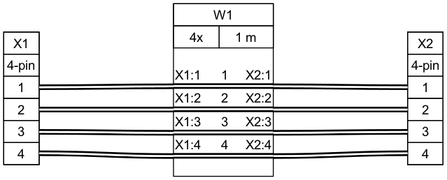

# WireViz Tutorial
## Bare-bones example

* Minimum working example
* Only 1-to-1 sequential wiring

[Source](tutorial01.yml):

```yaml
connectors:
  X1:
    pincount: 4
  X2:
    pincount: 4

cables:
  W1:
    wirecount: 4
    length: 1

connections:
  -
    - X1: [1-4]
    - W1: [1-4]
    - X2: [1-4]
```


Output:



## Adding parameters and colors

* Parameters for connectors and cables
* Auto-calculate AWG from mm2
* Non-sequential wiring

[Source](tutorial02.yml):

```yaml
connectors:
  X1:
    pincount: 4
    # More connector parameters:
    type: Molex KK 254
    subtype: female
  X2:
    pincount: 4
    type: Molex KK 254
    subtype: female

cables:
  W1:
    wirecount: 4
    # more cable parameters:
    length: 1
    gauge: 0.25 mm2
    show_equiv: true
    colors: [WH, BN, GN, YE]

connections:
  -
    - X1: [1-4]
    - W1: [1-4]
    # non-sequential wiring:
    - X2: [1,2,4,3]
```


Output:


## Pinouts, shielding, templates (I)

* Connector pinouts
  * Pincount implicit in pinout
* Cable color codes
* Cable shielding, shield wiring
* Templates

[Source](tutorial03.yml):

```yaml
connectors:
  X1: &template1 # define a template for later use
    pinout: [GND, VCC, RX, TX] # pincount implicit in pinout
    type: Molex KK 254
    subtype: female
  X2:
    <<: *template1 # reuse template

cables:
  W1:
    wirecount: 4
    length: 1
    gauge: 0.25 mm2
    show_equiv: true
    color_code: DIN # auto-assign colors based on DIN 47100
    shield: true # add cable shielding

connections:
  -
    - X1: [1-4]
    - W1: [1-4]
    - X2: [1,2,4,3]
  - # connect the shielding to a pin
    - X1: 1
    - W1: s
```


Output:


## Templates (II), American standards, daisy chaining (I)

* Overriding template parameters
* American standards: AWG gauge and IEC colors
* Linear daisy-chain

[Source](tutorial04.yml):

```yaml
connectors:
  X1: &template_con
    pinout: [GND, VCC, SCL, SDA]
    type: Molex KK 254
    subtype: male
    notes: to microcontroller # add notes
  X2:
    <<: *template_con # use template
    subtype: female   # but override certain parameters
    notes: to accelerometer
  X3:
    <<: *template_con
    subtype: female
    notes: to temperature sensor

cables:
  W1: &template_cbl
    wirecount: 4
    length: 0.3
    gauge: 24 AWG # specifying guage in AWG directly
    color_code: IEC # IEC 62 colors also supported
  W2:
    <<: *template_cbl
    length: 0.1

connections:
  -
    - X1: [1-4]
    - W1: [1-4]
    - X2: [1-4]
  - # daisy chain connectors (in line)
    - X2: [1-4]
    - W2: [1-4]
    - X3: [1-4]
```


Output:


## Ferrules, wire bundles, custom wire colors

* Ferrules
* Wire bundles
  * Internally treated as cables
  * Different treatment in BOM
* Custom colors
  * Wirecount can be implicit in color list

[Source](tutorial05.yml):

```yaml
connectors:
  X1:
    pinout: [+12V, GND, GND, +5V]
    type: Molex 8981
    subtype: female

ferrules: # ferrules
  F1:
    type: Ferrule, crimp
    subtype: 0.5 mm²
    color: OG # optional color

cables:
  W1:
    category: bundle # bundle
    length: 0.3
    gauge: 0.5 mm
    colors: [YE, BK, BK, RD] # custom colors, wirecount is implicit
    notes: hello!

connections:
  - # attach ferrules
    - F1
    - W1: [1-4] # a new ferrule is auto-generated for each wire
  - # attach connectors (separetely from ferrules)
    - W1: [1-4]
    - X1: [1-4]
```


Output:


## Custom ferrules

* Custom ferrules
  * Allows attaching more than one wire to a ferrule

[Source](tutorial06.yml):

```yaml
connectors:
  X1:
    pinout: [+12V, GND, GND, +5V]
    type: Molex 8981
    subtype: female
  F_10_1: # manually define a ferrule (with unique identifier)
    category: ferrule
    type: Ferrule, crimp
    subtype: 1.0 mm²
    color: YE

ferrules: # ferrules
  F_05:
    type: Ferrule, crimp
    subtype: 0.5 mm²
    color: OG # optional color

cables:
  W1:
    category: bundle # budnle
    length: 0.3
    gauge: 0.5 mm
    colors: [YE, BK, BK, RD] # custom colors, wirecount is implicit

connections:
  - # attach ferrules
    - F_05
    - W1: [1,4] # a new ferrule is auto-generated for each wire
  - # attach connectors (separetely from ferrules)
    - W1: [1-4]
    - X1: [1-4]
  -
    - F_10_1: 1 # manually defined ferrules are treated like regular connectors,
                # thus requiring a pin number
    - W1: 2
  -
    - F_10_1: 1
    - W1: 3
```


Output:


## Daisy chaining (II)

* Zig-zag daisy chain

[Source](tutorial07.yml):

```yaml
connectors:
  X1: &template_con
    type: Molex KK 254
    subtype: female
    pinout: [GND, VCC, SCL, SDA]
  X2:
    <<: *template_con
  X3:
    <<: *template_con
  X4:
    <<: *template_con
  X5:
    <<: *template_con
  X6:
    <<: *template_con

cables:
  W1: &template_wire
    gauge: 0.25 mm2
    length: 0.2
    colors: [TQ, PK, YE, VT]
    category: bundle
  W2:
    <<: *template_wire
  W3:
    <<: *template_wire
  W4:
    <<: *template_wire
  W5:
    <<: *template_wire

connections:
  -
    - X1: [1-4]
    - W1: [1-4]
    - X2: [1-4]
  -
    - X3: [1-4]
    - W2: [1-4]
    - X2: [1-4]
  -
    - X3: [1-4]
    - W3: [1-4]
    - X4: [1-4]
  -
    - X5: [1-4]
    - W4: [1-4]
    - X4: [1-4]
  -
    - X5: [1-4]
    - W5: [1-4]
    - X6: [1-4]
```


Output:


